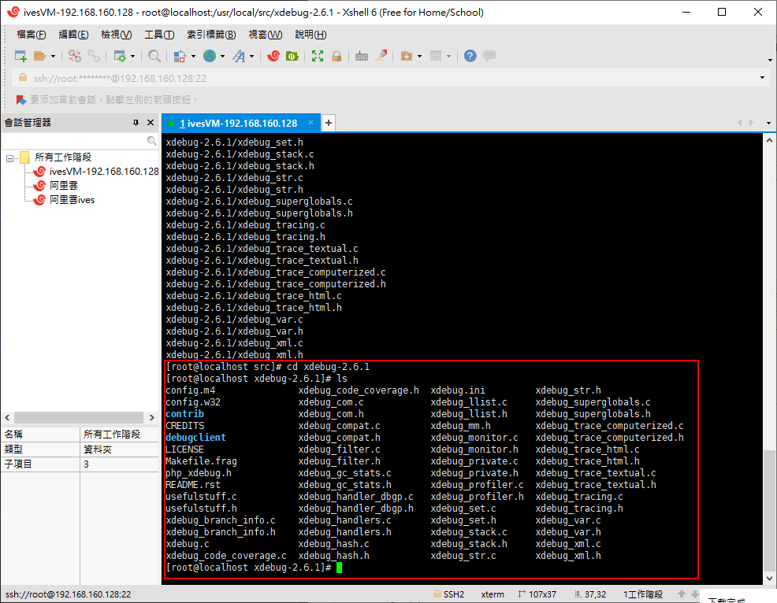

# PHP Xdebug

# 下載

Xdebug 2.6.1

Release date: 2018-08-02

https://xdebug.org/download/historical


# 準備安裝

拷貝到對應的資料夾


解壓

```bash
tar -zxvf xdebug-2.6.1.tgz
```

```bash
cd xdebug-2.6.1
```

查看一下，並沒有configure檔(綠色的)



找到phpize的位置

```bash
find / -name phpize
```


執行phpize

```bash
/usr/local/webserver/php/bin/phpize

或

/usr/bin/phpize

```

產生對應的configure檔案了


# configure

找到php-config的位置

在/usr/local/webserver/php/bin/php-config

```bash
find / -name php-config
```


--with-php-config= 填入對應的目錄

```bash
./configure --enable-xdebug --with-php-config=/usr/local/webserver/php/bin/php-config

或

./configure --enable-xdebug --with-php-config=/usr/bin/php-config

```


# make

```bash
make
```


# make install

```bash
make install
```


### 設定配置檔(作法一)

找尋php.ini檔
```bash
find / -name php.ini
```
拷貝一份並在最下面加上擴展

```bash
zend_extension=xdebug.so

xdebug.remote_autostart=1
xdebug.remote_host=196.168.160.128
xdebug.remote_port=8000
xdebug.remote_enable=on
```

存放到php-fpm的設定檔目錄(依自己安裝的目錄而有異動)

再重啟php-fmp下指令php-m應該就可以看到xdebug了!!

```bash
php -m
```

### 設定配置檔(作法二-VM)
```bash
cd /etc/php.d/
```
在/etc/php.d/隨意拷一個設定檔，改名成swoole.ini，並修改內容增加擴展

```bash
cp 20-mysqlnd.ini xdebug.ini
vi xdebug.ini
```

```bash
zend_extension=xdebug.so

xdebug.remote_autostart=1
xdebug.remote_host=196.168.160.128
xdebug.remote_port=8000
xdebug.remote_enable=on
```


```bash
php -m
```


# xdebug.ini

```ini
zend_extension=xdebug.so

xdebug.remote_autostart=1
xdebug.remote_host=196.168.160.128
xdebug.remote_port=8000
xdebug.remote_enable=on
```